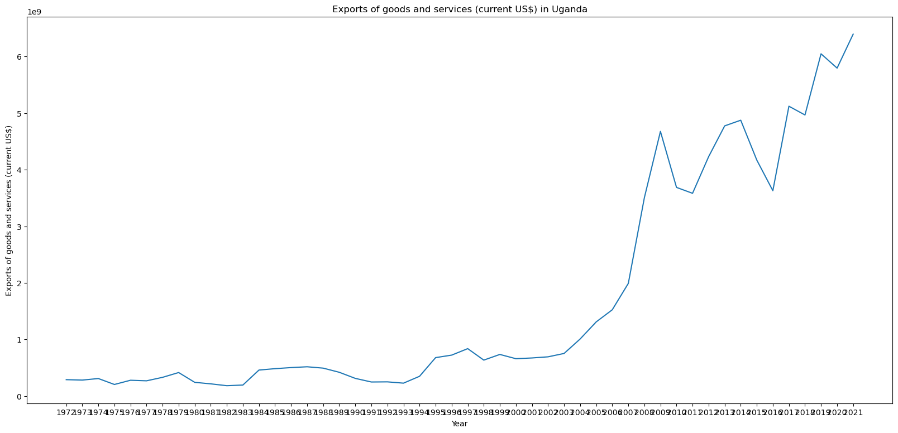
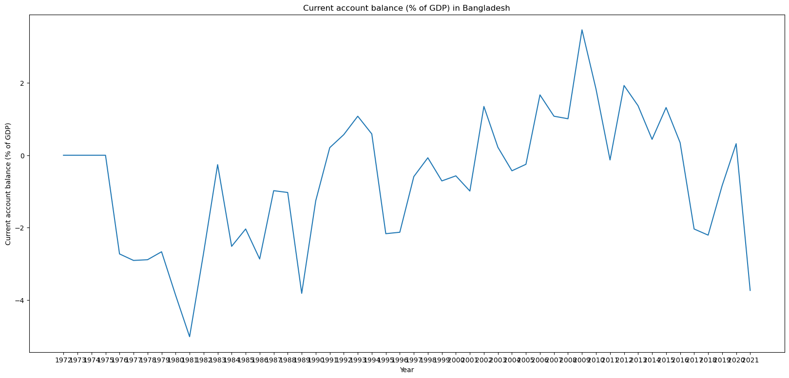

# Impact of IMF on Developping Countries 🌍

#### What is the impact of IMF loans towards borrowers' GDP and Poverty Statistics. 

## Database Creation 📋

### I. IMF Database creation
#### Objective: Download a CSV of data from developping countries with GDP and Poverty indicators as well as IMF loans figures.  

~ **Step 1**: From the WorldBank.org I downloaded the usefull data.
- I selected all countries from south Asia, Latine America and Africa. 
- I selected the entire time horizon available: 1970 to 2021.
- I had access to 1442 indicators. I exctacted a short list of indicators coming from only two categories: 
  - Economic Policy & Debt
  - Poverty  
    - This was still 411 lines of data per country. I reviewed every line and decided to keep a short list of 40 indicators per country.

~ **Step 2**: Database cleaning (columns names, nulls, typos and types of data)

### II. Exterior Debt to GDP per country 
#### Objective: What is the international borrowing situation of IMF borrowers ?  
In addition to the evolution of GDP and poverties indicators for each country financed by the IMF, knowing its debt % towards external countries in comparation to its GDP would be an interesting additional indicator.

~ **Step 1**: Collect the data from https://en.wikipedia.org/wiki/List_of_countries_by_external_debt  
Use of BeautifulSoup.   
~ **Step 2**: Clean the data and export it to a DataFrame  
~ **Step 3**: Link the Data to the IMF DataFrame through a primary key "id_Name".  

### III. Credit Rating
#### Objective: Credits are not free. Neither are the ones accorded by IMF or the World Bank. Interest rates are often influenced by the nation's credit rating. How tend to be rated IMF borrowers ?   
~ **Step 1**: Using Selenium I extracted the ratings from: https://tradingeconomics.com/country-list/rating  
~ **Step 2**: Clean the data and export it to a DataFrame    
~ **Step 3**: Link the Data to the IMF DataFrame through a primary key "id_Rating".  

## Database Exportation to SQL 📚
I uploaded the three tables to SQL.  
IMF is linked to the table debt and the table ratings through the foreign keys 'id_Name' and 'id_Ratings'

complete view :

## Analysis 📊

78 countries from Latin America, South Asia or Africa received loans from the IMF.
I realised a random sample and obtain to analyse the 5 following countries:

From my still long short list of indicators I decided to select the following ones:

- IMF Loans indicators:   
  - 'Use of IMF credit (DOD, current US$)' : Total outstanding Loan from IMF  
  - 'Debt service on external debt' : sum of the principal repayments and interest payments actually made on these debts.
  - 'Adjusted net national income (annual % growth)' : total dollar value of everything produced by a country and the income its residents receive (Like GDP but only for resident)
  - 'Inflation, GDP deflator (annual %)' : inflation of local currency
 
- 'GDP growth (annual %)' : Increase of GDP

- Exports and Imports : 
  - 'Exports of goods and services (current US$)': Total Exports
  - External balance on goods and services (% of GDP) : X-M
  'Current account balance (% of GDP)' : X-M as % of GDP

- poverty:
  - 'Income share held by highest 20%'
  - Income share held by lowest 10%
  - Poverty headcount ratio at national poverty lines (% of population) - Bangladesh
  - Income share held by highest 10%
  - Income share held by lowest 20%

###  Uganda 
Increase of IMF loans towards $ 1.4 billion in 2021:   

Debt is never free. $800M of principal + interest in 2021 alone: 

Inflation stable

GDP increased until 1994. Shrinking since then.

Exports skyrocked:

But the current account balance is deeply negative showing that imports > exports:  

% of Poverty seems improving:

10% richer got a slightly richer with 35% of incomes:

10% poorer remained stagnant with 2.5% of incomes:

Based on SQL query: 
- Uganda has a credit rating of B-, an external debt to GDP of 41% and an External Debt $37M bl

### Bangladesh 
Increase of IMF loans towards $ 3.2 billion in 2021:   

Debt is never free. $5.7bl of principal + interest in 2021 alone: 

The net income as % of gdp going to the population tanks close to 0:  

GDP increase is stable at around 5%. So no sign of improvement since IMF loans.

Exports skyrocked:

But the current account balance is negative showing that imports > exports:  

% of Poverty seems improving:

10% richer got a richer with currently 25% of total incomes:

10% poorer remained stagnant with aroung 3.5% of incomes:

Based on SQL query:   
- banglades has a credit rating of BB-, an external debt to GDP of 22% and an External Debt $78 bl   

### Summary of results

#### Based on my random sample of 5 countries 'Uganda', 'Bangladesh', 'El Salvador', 'Senegal', 'Rwanda':

For the 5 countries, the GDP growth percentage is relatively stable with no signs of improvement or decline.  
For each of the countries:  
- There has been a drastic increase in loans from the IMF since the onset of the COVID-19 pandemic.  
- This increase in loans has led to a rise in the yearly principal and interest payments, which now run into hundreds of millions.   
   According to the New York Times, 70% of Argentina's debt service on external debt, including a nearly $1.6 billion bill from the IMF, is for surcharges only. (link: https://www.nytimes.com/2022/01/14/business/economy/imf-surcharges.html)   

- The total exports in USD have skyrocketed in recent years.   
- However, each country has a deeply negative current account balance, which is getting worse (with the exception of Senegal, which has remained relatively stable at -5%).  

- In terms of poverty:   
    - Uganda, Bangladesh and Senegal have not seen any improvement in the distribution of income over the last 50 years, with around 30% of the total income going to the top 10% and 2.5% going to the bottom 10% of the population.  
    - El Salvador and Rwanda have seen slight improvements in the distribution of income over the last 25 years, with the top 10% of the population's share of total income decreasing from 40% to 35% and the bottom 10% slightly increasing.  

Conclusion:
The article "Structural Adjustment: How the IMF and World Bank Repress Poor Countries and Funnel Their Resources to Rich Ones" by Alex Gladstein highlights the ways in which IMF loans benefit developed countries more than the countries receiving the loans. The loans come with high interest rates and are denominated in USD, forcing the borrowing countries to focus on exporting goods to developed countries to earn the required currency. This shift in the economy negatively impacts the local population, who have to change their jobs and are unable to work to produce food for themselves and their families. Additionally, these loans are often granted to dictatorial regimes, further harming the population as the regime benefits from the loan at their expense. The IMF's control over these countries through their debt only exacerbates the situation.   

The data analysis shows that the countries receiving loans do indeed increase their exports in USD terms, leading to a rise in imports as the local population is no longer producing goods for their own consumption. The analysis does not reveal any improvement or deterioration in the countries' GDP or poverty levels.   

Based on 10 indicators selected for a random sample of 5 countries, we cannot challenge the facts presented by Alex Gladstein in his article.  
https://bitcoinmagazine.com/culture/imf-world-bank-repress-poor-countries

